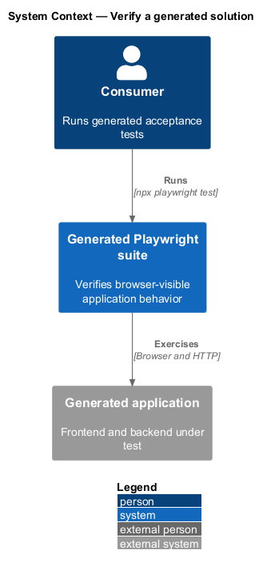
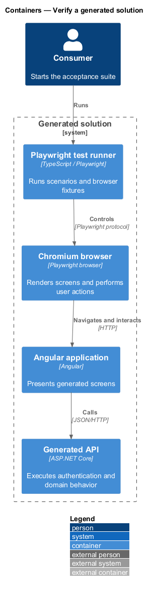
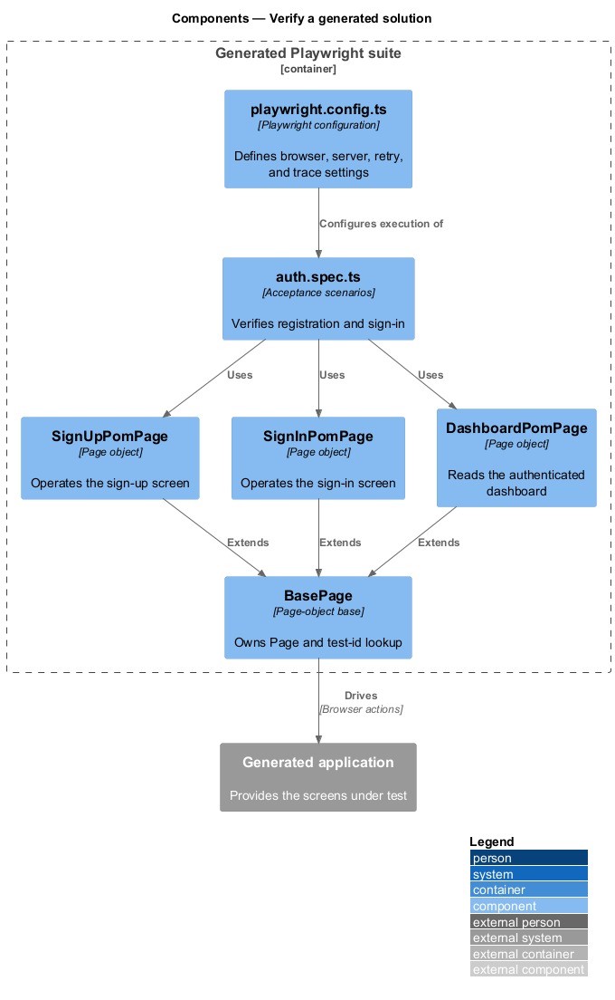
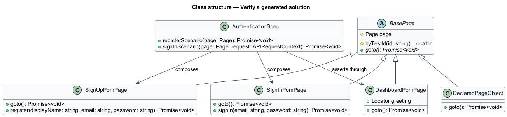
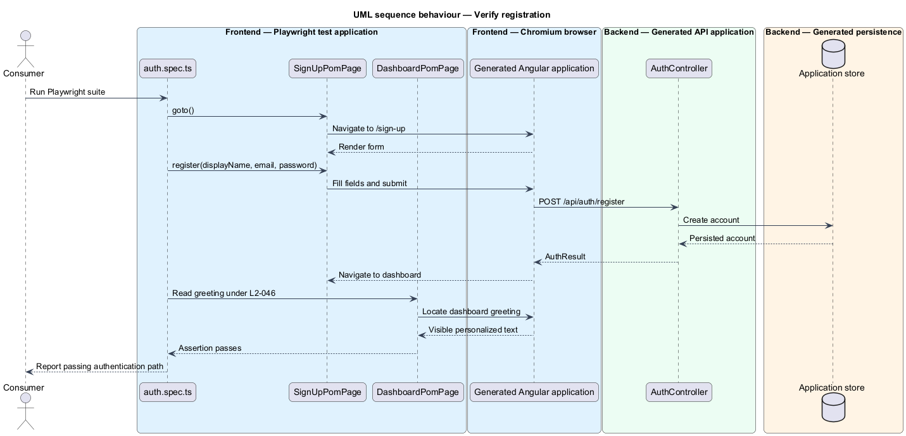

# Verify a generated solution

## Overview

Every generated solution contains a Playwright end-to-end test area. An
*acceptance test* exercises externally visible behavior against the running
frontend and backend. A *page object* wraps selectors and user actions for one
screen so tests describe outcomes without repeating browser mechanics.

This feature creates the harness, baseline page objects, manifest-page objects,
and authentication scenarios needed to verify a new scaffold before domain work
begins.

## Description

- **`playwright.config.ts`** — sets the test directory, Chromium project,
  frontend base URL, retry policy, trace capture, and frontend web server.
- **`BasePage`** — abstract page-object base that owns the Playwright `Page`,
  exposes test-id lookup, and requires `goto()`.
- **`SignUpPomPage`, `SignInPomPage`, and `DashboardPomPage`** — baseline page
  objects for the authentication path.
- **Manifest page objects** — one generated page-object file per declared page,
  as demonstrated by `ProjectsPomPage` and `SettingsPomPage` in `out/Acme`.
- **`auth.spec.ts`** — baseline scenarios for registration and sign-in. The
  registration scenario asserts that the new user reaches the dashboard.
- **`data-testid` attributes** — stable selector contract shared by generated
  page templates and their page objects.

Requirement-header comments for generated acceptance tests remain
`<TO SUPPLY>` because `L2-047` is planned and the current sample test omits
traceability comments.

## Requirements

The table reproduces the normative requirement text from `docs/specs/L2.md`.

| L2 ID | Refines (L1) | Requirement |
|-------|--------------|-------------|
| `L2-044` | `L1-010` | Every generated solution must include a configured end-to-end test harness organised around the page-object pattern. |
| `L2-045` | `L1-010` | Every screen, whether baseline or consumer-declared, must have a corresponding page object. |
| `L2-046` | `L1-010` | The shipped end-to-end suite must contain at least one test that passes without modification, proving the authentication path works. |
| `L2-047` | `L1-010` | Every acceptance test shipped with or written against the product must declare the requirements it covers. |

## Diagrams

### System context

The consumer runs Playwright against the generated application to verify the
authentication path and each generated screen.

### Containers

The Playwright runner drives the Angular application and calls the generated API
through the same browser-visible boundaries used in normal operation.

### Components

Test scenarios delegate browser actions to page objects, which select stable
elements in the generated page components.

### Class structure

Each page object inherits from `BasePage`; authentication scenarios compose the
page objects needed for their behavior.

### Behaviour — verify registration

The test uses `SignUpPomPage` to register, then asserts dashboard visibility as
the first-run proof required by `L2-046`.

