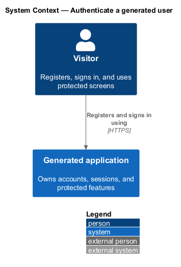
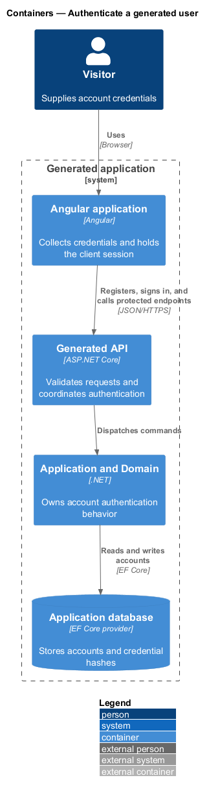
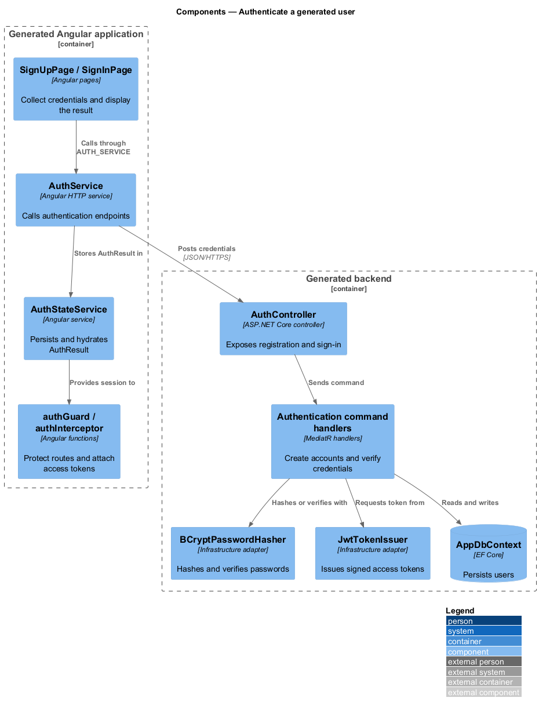
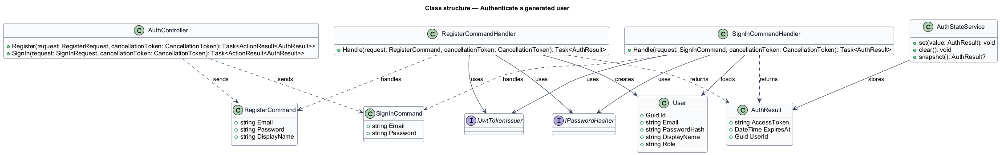
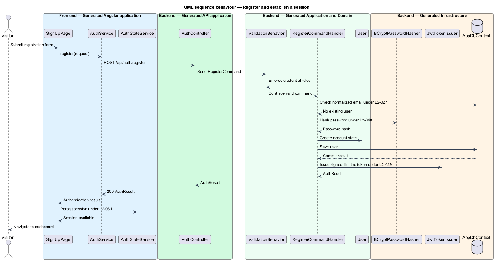

# Authenticate a generated user

## Overview

Generated applications include registration, credential-based sign-in, and a
client session without additional manifest declarations. An *access token* is a
signed, time-limited JSON Web Token (JWT) that identifies the account and role
for protected API requests. A *client session* is the browser-held
`AuthResult` containing that token and its expiry.

This feature crosses the generated Angular application, API, application layer,
domain model, and infrastructure layer. It covers account creation, sign-in,
token issuance and validation, protected navigation, token attachment, and
sign-out behavior.

## Description

Every type below is generated code, rendered from templates embedded in
`Mvp.Core`. None of it is a runtime dependency of the product: the authentication
vertical slice is emitted into the consumer's solution and owned by the adopting
team from that point on.

- **`SignUpPage` and `SignInPage`** — standalone Angular pages that collect
  credentials through Angular Material forms and call `AUTH_SERVICE`.
- **`IAuthService`, `AUTH_SERVICE`, and `AuthService`** — frontend contract,
  injection token, and HTTP implementation for `/api/auth/register` and
  `/api/auth/sign-in`.
- **`AuthStateService`** — signal-backed session store. It persists
  `AuthResult` in `localStorage`, hydrates on reload, and clears the session on
  sign-out.
- **`authInterceptor`** — HTTP interceptor that adds the bearer token when a
  session exists.
- **`authGuard`** — route guard that checks the recorded expiry and redirects
  unauthenticated or expired sessions to `/sign-in` with a return URL.
- **`AuthController`** — generated API controller that maps registration and
  sign-in requests to MediatR commands.
- **`RegisterCommandHandler`** — normalizes the email, checks uniqueness, hashes
  the password, persists `User`, and issues an access token.
- **`SignInCommandHandler`** — loads the account, verifies the password using a
  common failure, records the sign-in time, and issues an access token.
- **`BCryptPasswordHasher` and `JwtTokenIssuer`** — infrastructure adapters for
  one-way password hashing and HMAC-SHA256 token creation.
- **JWT bearer configuration** — validates issuer, audience, lifetime, and
  signing key before protected controllers execute.

Automatic response handling for a token that expires during an active request
remains `<TO SUPPLY>`; the current route guard handles expiry during navigation.

## Requirements

The table reproduces the normative requirement text from `docs/specs/L2.md`.

| L2 ID | Refines (L1) | Requirement |
|-------|--------------|-------------|
| `L2-027` | `L1-006` | The generated backend must accept a registration request and create an account for a previously unregistered email address. |
| `L2-028` | `L1-006` | The generated backend must exchange valid credentials for an access token and must reject invalid credentials without disclosing which element was wrong. |
| `L2-029` | `L1-006` | Issued access tokens must be signed, time-limited, and must carry the claims the application needs to identify and authorise the caller. |
| `L2-030` | `L1-006` | Protected endpoints must accept only tokens that pass full validation. |
| `L2-031` | `L1-006` | The generated frontend must retain the authenticated session across page reloads and must attach the access token to requests it makes to the generated backend. |
| `L2-032` | `L1-006` | Screens that require authentication must be unreachable without a session, and the visitor must be routed somewhere useful rather than shown an error. |
| `L2-033` | `L1-006` | The generated frontend must allow a visitor to end their session deliberately, and must handle an expired session without stranding the visitor. |

## Diagrams

### System context

The visitor authenticates through the generated application, which owns account
and token data without an external identity provider.

### Containers

The Angular application calls the generated API, which uses the application and
infrastructure layers to persist accounts and issue tokens.

### Components

The frontend session components and backend authentication handlers form one
slice from credential entry to protected navigation.

### Class structure

The handlers depend on password, token, clock, and persistence abstractions;
`AuthStateService` consumes the returned `AuthResult` on the frontend.

### Behaviour — register and establish a session

Registration validates credentials, hashes the password under `L2-027`, issues
a token under `L2-029`, and stores the returned session under `L2-031`.

