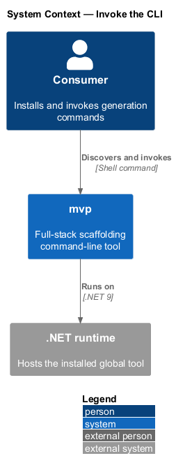
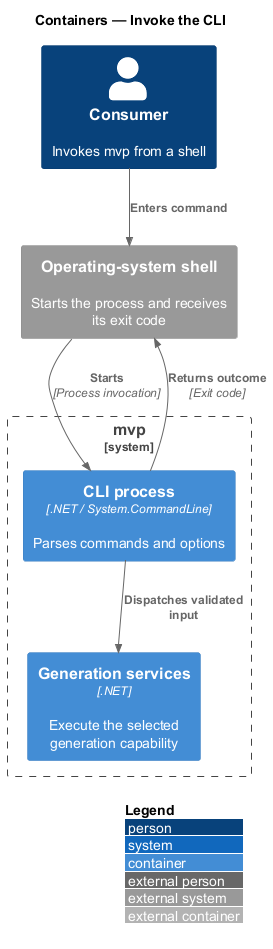
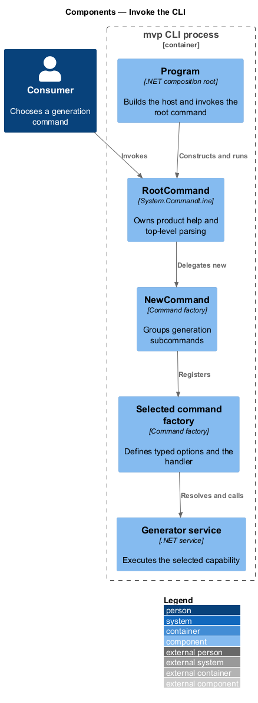
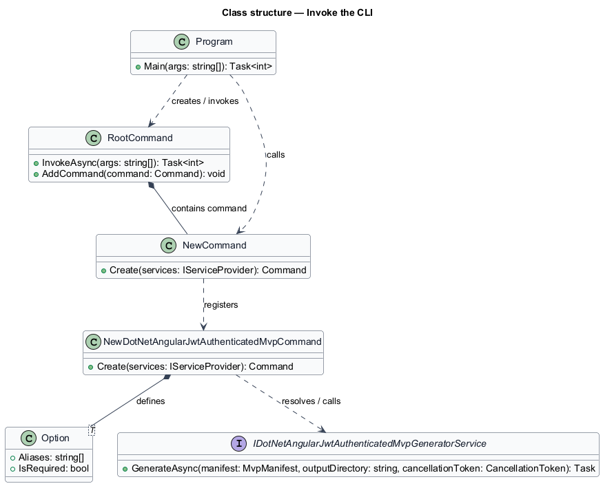
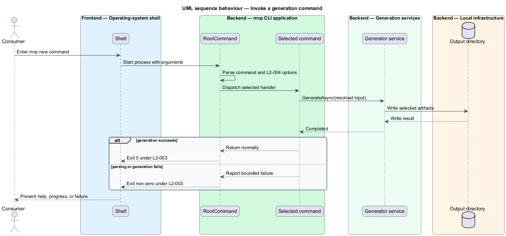

# Invoke the CLI

## Overview

`mvp` is a .NET global tool that exposes solution scaffolding through one command
tree. A *command tree* is the hierarchy of verbs, subcommands, and options that
`System.CommandLine` parses for one invocation. The root command explains the
product, and the `new` command groups each generation capability.

This feature covers installation, help discovery, option conventions, command
selection, and process exit status. It ends when a selected command hands valid
input to a generator or reports a failure to the invoking shell.

## Description

- **`Mvp.Cli.csproj`** — .NET tool package definition. It targets `net9.0`,
  sets `PackAsTool`, and publishes the stable command name `mvp`.
- **`Program`** — process composition root. It creates the host, registers the
  service graph, constructs the root command, and invokes the parser.
- **`NewCommand`** — `new` command-group factory. It registers the nine
  generation subcommands exposed by the current source.
- **`NewSolutionCommand` and peer command factories** — command builders for
  `solution`, `api`, `core`, `infrastructure`, `app`, the three Angular library
  variants, and `dotnet-angular-jwt-mvp`.
- **`Option<T>` instances** — typed definitions for `--name`/`-n`,
  `--output`/`-o`, and, where applicable, `--config`/`-c`.
- **Generator service interfaces** — boundaries such as
  `ISolutionGeneratorService` and
  `IDotNetAngularJwtAuthenticatedMvpGeneratorService`. Command handlers resolve
  these interfaces from dependency injection after parsing succeeds.
- **Command error handlers** — exception boundaries that log the operation and
  set a non-zero process outcome. The current handlers call
  `Environment.Exit(1)` on generation errors.

## Requirements

The table reproduces the normative requirement text from `docs/specs/L2.md`.

| L2 ID | Refines (L1) | Requirement |
|-------|--------------|-------------|
| `L2-001` | `L1-001` | The product must expose a root command that describes the product's purpose and lists its available command groups. Help must be available at every level of the command tree. |
| `L2-002` | `L1-001` | All generation capabilities must be reachable under one grouping verb, so that the command surface remains predictable as capabilities are added. |
| `L2-003` | `L1-001` | The product must communicate outcome through its process exit code so that it can be used safely in scripts and automated pipelines. |
| `L2-004` | `L1-001` | Options that carry the same meaning must be named and abbreviated identically across every command. |
| `L2-005` | `L1-002` | The product must be packaged as a .NET global tool that installs a single stable executable command. |
| `L2-006` | `L1-002` | The product must declare its runtime prerequisite and must fail with an intelligible message rather than an unhandled error when that prerequisite is unmet. |

## Diagrams

### System context

The consumer invokes `mvp` from a shell, while the .NET runtime hosts the tool
and returns its exit status to the shell.

### Containers

The command-line process parses input and dispatches generation through the
registered service graph.

### Components

The root command delegates to `NewCommand`, which selects a concrete command
factory and its generator-service boundary.

### Class structure

The command factories create the command and option objects that depend on
generator interfaces resolved from the host service provider.

### Behaviour — invoke a generation command

The invocation parses options, resolves the selected generator, and returns a
deterministic success or failure outcome under `L2-003`.

