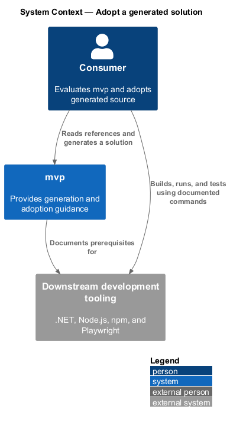
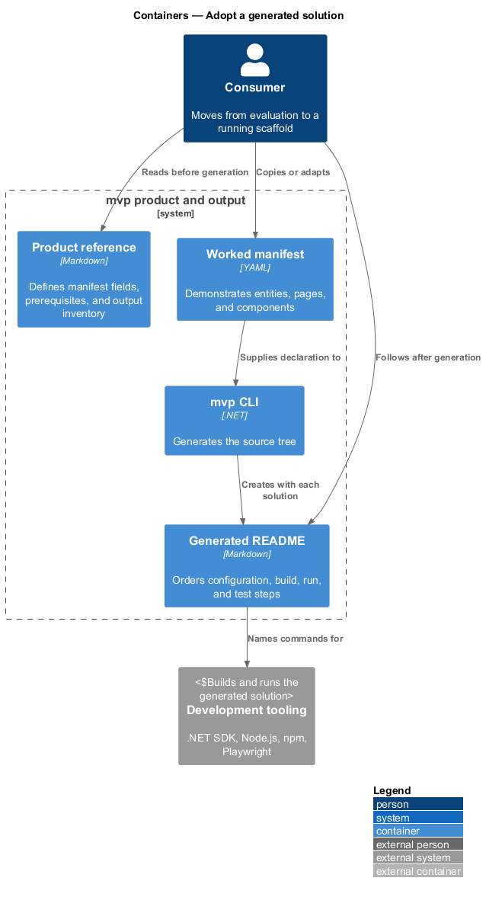
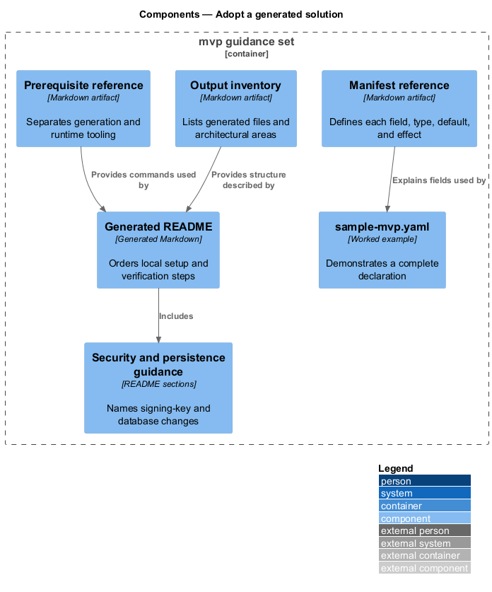
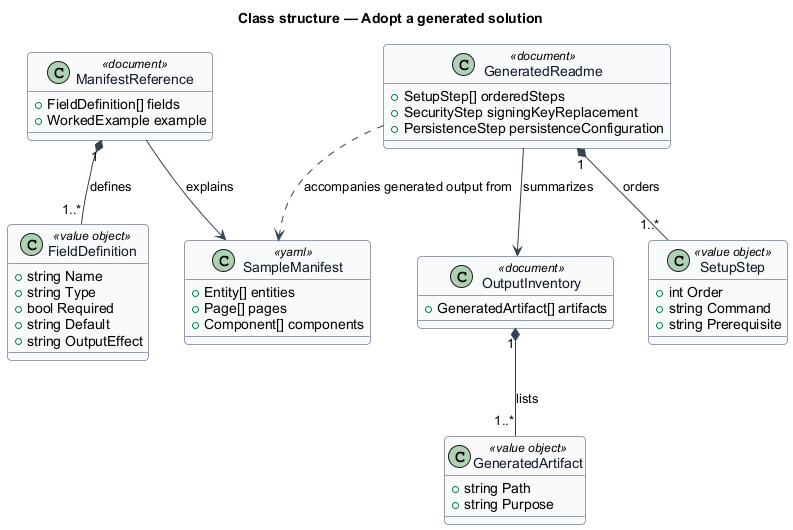
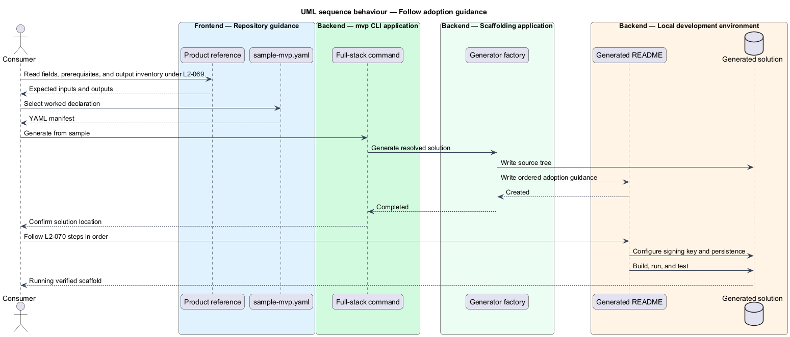

# Adopt a generated solution

## Overview

Adoption guidance explains the generator before use and the generated solution
after creation. A *manifest reference* defines every supported input field and
default. An *output inventory* identifies the files and architectural areas that
generation produces. *Post-generation guidance* orders the restore, build,
configuration, run, and test activities performed after scaffolding.

This feature connects product reference material, the worked sample manifest,
and the README placed at the root of each generated solution.

## Description

- **`samples/sample-mvp.yaml`** — worked manifest that declares two entities,
  two authenticated pages, and one component.
- **Generated root `README.md`** — describes the backend, frontend, and
  Playwright layout. It provides backend build and run commands, frontend
  installation and start commands, and browser installation and test commands.
- **Persistence guidance** — states that the default store is in memory and
  identifies `ConnectionStrings:Default` as the SQL Server configuration path.
- **Signing-key guidance** — tells the consumer to replace `Jwt:SigningKey`
  before use outside development.
- **Product manifest reference** —
  `skills/dotnet-angular-jwt-mvp/references/manifest-schema.md` is the canonical
  field-by-field input reference.
- **Product output inventory** —
  `skills/dotnet-angular-jwt-mvp/references/forge-shape.md` is the canonical
  file-level inventory.
- **Prerequisite reference** — the root `README.md` distinguishes the .NET 10
  generation requirement from Node.js and Playwright runtime requirements.
- **Documentation index and traceability** — `docs/README.md` routes readers,
  while `docs/requirements-traceability.md` binds implemented L2 requirements
  to named tests and CI jobs.

## Requirements

The table reproduces the normative requirement text from `docs/specs/L2.md`.

| L2 ID | Refines (L1) | Requirement |
|-------|--------------|-------------|
| `L2-069` | `L1-017` | The product must document its input format and its output inventory in enough detail that a consumer can predict the result before running it. |
| `L2-070` | `L1-017` | The consumer must be told, in order, what to do with a solution once it has been generated. |

## Diagrams

### System context

The consumer reads product references before generation and the generated README
afterward; both forms of guidance describe the same manifest-to-solution flow.

### Containers

Repository documentation and the sample manifest support pre-generation work,
while the generated README supports configuration, build, run, and test work.

### Components

The reference, worked sample, output inventory, and generated README divide
input guidance from post-generation guidance.

### Class structure

Documentation artifacts relate manifest fields to generated outputs and ordered
post-generation steps.

### Behaviour — follow adoption guidance

The consumer validates prerequisites, generates from the worked manifest, then
follows the generated README through signing-key replacement, build, and test.

