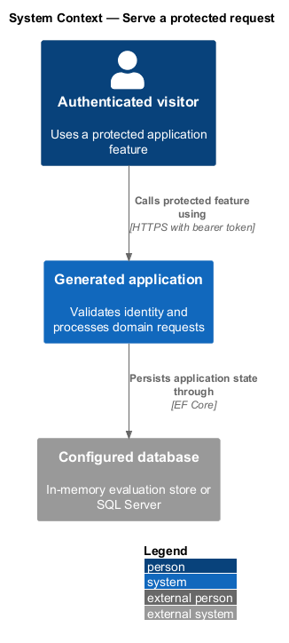
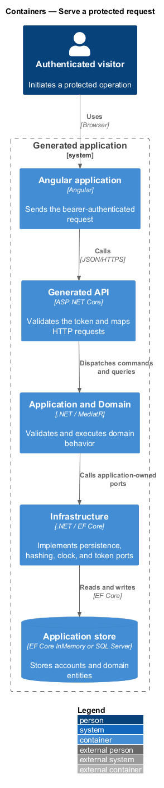
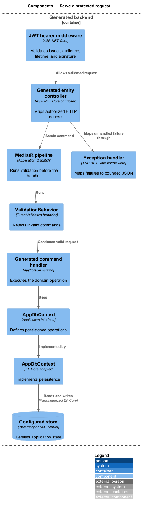
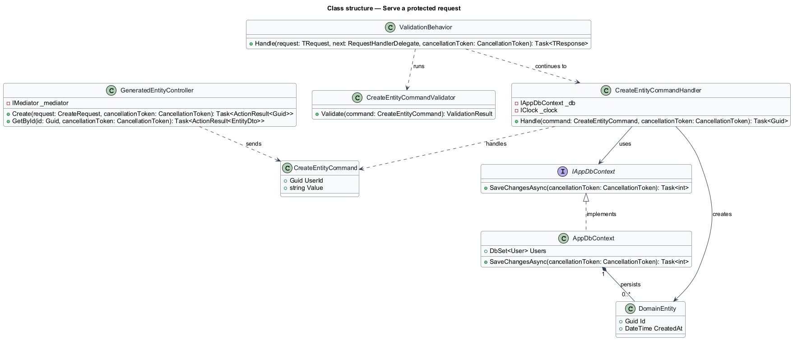
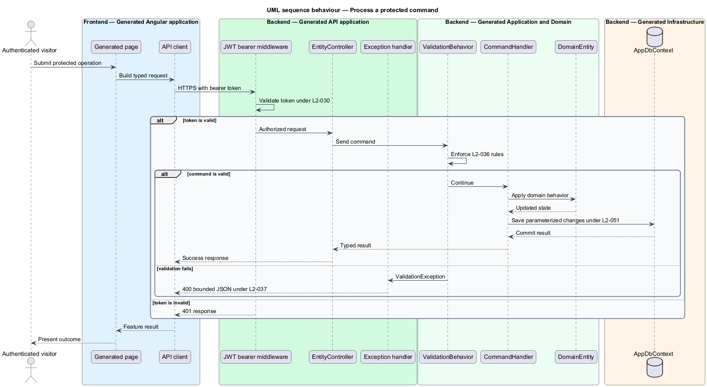

# Serve a protected request

## Overview

The generated backend exposes authenticated HTTP endpoints through four inward-
pointing layers: API, Application, Domain, and Infrastructure. A *protected
request* is an API call that passes JWT bearer validation before reaching its
controller. A *persistence provider* is the Entity Framework Core adapter that
stores application state in memory or in SQL Server.

This feature follows a request from the API boundary through validation and
application handling to persistence. It also covers password and secret
handling, cross-origin access, error disclosure, and the default database mode.

## Description

Every element below is generated code, rendered from templates embedded in
`Mvp.Core`. The layering described here is a property of those templates, so it
holds for any host that drives the engine.

- **Generated project references** — the Domain project has no inward
  dependency, Application depends on Domain, Infrastructure implements
  Application abstractions, and API composes the runtime.
- **Generated `Program`** — registers controllers, application and
  infrastructure services, the explicit development CORS origin, JWT bearer
  validation, authorization, and the exception boundary.
- **`ValidationBehavior<TRequest,TResponse>`** — MediatR pipeline behavior that
  executes all FluentValidation validators before a request handler.
- **Generated controllers** — `[ApiController]` endpoints translate HTTP models
  into commands and queries. Entity controllers carry `[Authorize]`.
- **Generated command and query handlers** — application-layer units that use
  `IAppDbContext`, `IClock`, and other abstractions without depending on API or
  infrastructure types.
- **`AppDbContext`** — EF Core implementation of `IAppDbContext`. It configures
  account fields and indexes without returning credential fields in DTOs.
- **`InfrastructureDependencyInjection`** — selects EF Core InMemory when
  `ConnectionStrings:Default` is absent or `InMemory`; any other value selects
  the SQL Server provider.
- **`BCryptPasswordHasher`** — BCrypt adapter with a configured work factor of
  12 for irreversible credential storage.
- **`JwtTokenIssuer` and bearer validation** — create and validate signed tokens
  with issuer, audience, lifetime, signing-key, subject, email, display-name,
  role, and token-identifier data.
- **Exception handler** — converts validation and authentication-domain
  failures into bounded JSON responses and returns a generic title for
  unexpected exceptions.

`L2-049` remains partial because the generated non-development process does not
yet reject the placeholder signing key. Runtime benchmark execution and
enforcement for `L2-059` remain `<TO SUPPLY>`.

## Requirements

The table reproduces the normative requirement text from `docs/specs/L2.md`.

| L2 ID | Refines (L1) | Requirement |
|-------|--------------|-------------|
| `L2-034` | `L1-007` | The generated backend must separate domain, application, infrastructure, and interface concerns, with dependencies pointing inward only. |
| `L2-035` | `L1-007` | A freshly generated backend must compile without manual intervention while treating compiler and dependency-audit warnings as errors. |
| `L2-036` | `L1-007` | Every command that enters the application layer must be validated before its handler executes, without each handler restating validation logic. |
| `L2-037` | `L1-007` | The generated backend must return a consistent, predictable error shape and must never surface internal detail to a caller. |
| `L2-048` | `L1-011` | Account passwords must never be stored or transmitted in a recoverable form. |
| `L2-049` | `L1-011` | A generated solution must not ship with a usable secret, and must not run in a non-development configuration with an unsafe one. |
| `L2-050` | `L1-011` | The generated backend must accept cross-origin requests only from explicitly listed origins. |
| `L2-051` | `L1-011` | Every value that crosses the boundary into the generated backend must be validated, and no untrusted value may be interpolated into a query or command. |
| `L2-052` | `L1-011` | Failure responses must be useful to the caller and useless to an attacker. |
| `L2-054` | `L1-012` | A generated solution must run immediately without a database installation, and the consequence of that default must be stated. |
| `L2-055` | `L1-012` | Moving a generated solution to a durable database must not require code or dependency changes. |
| `L2-056` | `L1-012` | Passwords, hashes, and signing keys must never appear in a response, a log entry, or a diagnostic payload. |
| `L2-059` | `L1-013` | Generated solutions must meet stated default performance budgets so that consumers start from a healthy baseline. |

## Diagrams

### System context

The visitor calls the generated application, whose backend protects requests
and stores state through a configured local persistence provider.

### Containers

The browser calls the API over HTTPS; the API invokes application logic and
uses infrastructure adapters for persistence and token operations.

### Components

The API controller sends a validated request to a handler through MediatR, and
the handler uses `IAppDbContext` implemented by `AppDbContext`.

### Class structure

The controller depends on MediatR, the validation behavior surrounds the
handler, and infrastructure realizes application-owned abstractions.

### Behaviour — process a protected command

The API validates the token, enforces `L2-036` before handler execution,
persists parameterized changes, and maps failures under `L2-037` and `L2-052`.

