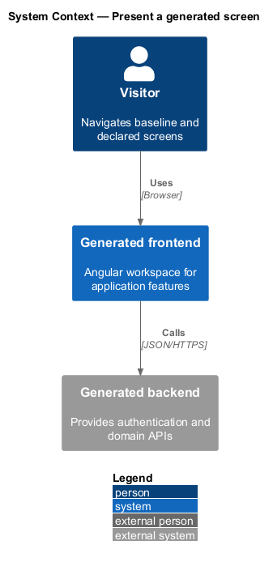
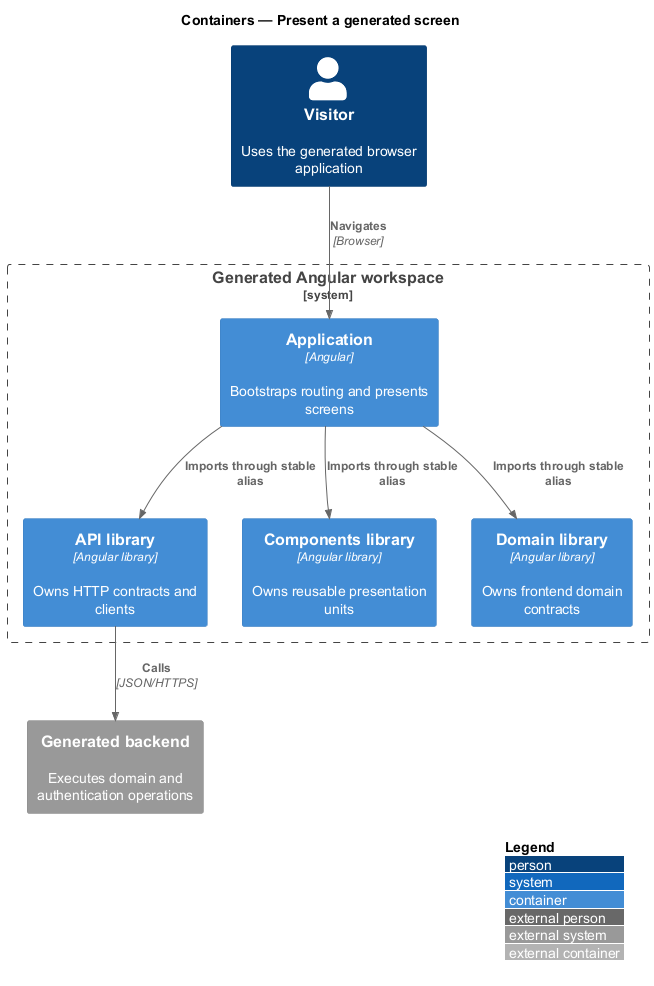
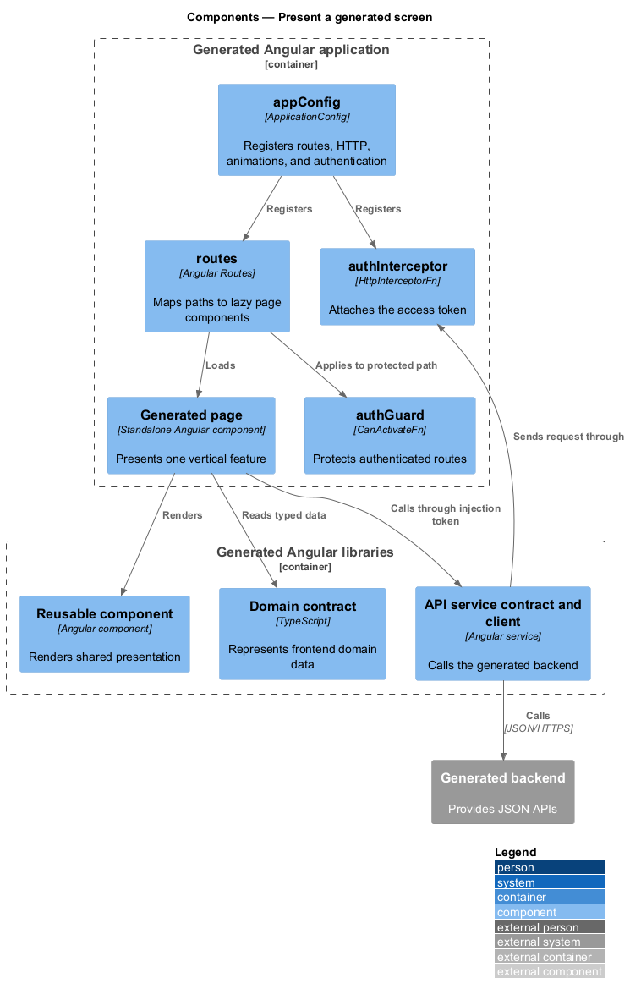
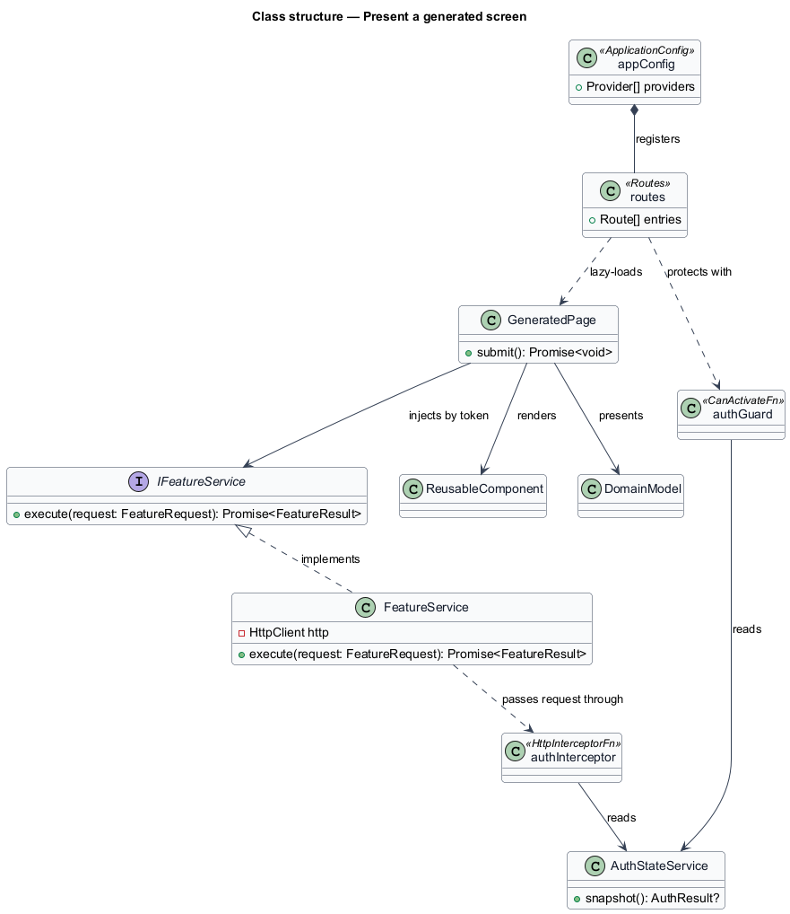
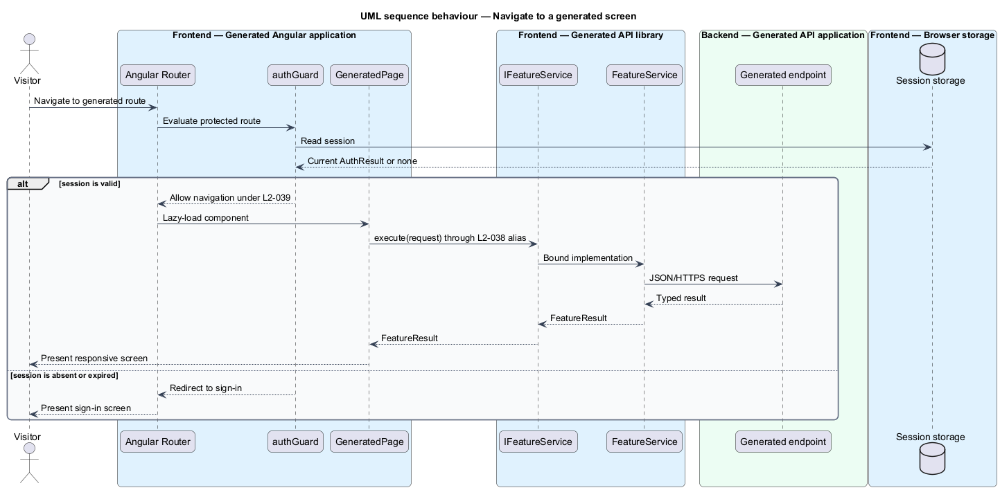

# Present a generated screen

## Overview

The generated frontend is one Angular workspace containing a runnable
application and three libraries named `api`, `components`, and `domain`. A
*generated screen* is either a baseline route or a manifest-declared route
represented by an Angular page component.

This feature covers workspace boundaries, stable imports, application startup,
routing, network and authentication registration, responsive primitives, and
the accessibility baseline for each screen.

## Description

- **`angular.json`** — workspace inventory for the application and three
  libraries.
- **`tsconfig.json` path aliases** — stable imports such as `@acme/api`,
  `@acme/components`, and `@acme/domain` in the checked-in sample.
- **`appConfig`** — single startup configuration that registers the router,
  HTTP client and `authInterceptor`, Angular animations, and the `AUTH_SERVICE`
  implementation.
- **`routes`** — lazy route declarations for sign-in, sign-up, dashboard, and
  manifest pages. Protected routes attach `authGuard`.
- **Page components** — standalone Angular components for baseline and declared
  screens. Form screens use Angular Material controls and native form labels.
- **API library** — HTTP contracts, request and result models, concrete clients,
  and injection tokens.
- **Components library** — reusable presentation units. Manifest component
  generation currently produces a placeholder unit.
- **Domain library** — frontend domain contracts and domain-aware services.
- **`index.html` viewport declaration** — sets device-width rendering and an
  initial scale of 1.
- **Global and host styles** — establish full-height document flow and a
  minimum-height application host.

Automated library-boundary enforcement, complete fluid layouts, breakpoint
rules, keyboard checks, assistive-technology checks, and contrast verification
remain `<TO SUPPLY>` under the partial and planned requirements.

## Requirements

The table reproduces the normative requirement text from `docs/specs/L2.md`.

| L2 ID | Refines (L1) | Requirement |
|-------|--------------|-------------|
| `L2-038` | `L1-008` | The generated frontend must be a single workspace whose libraries are imported through stable aliases rather than relative paths. |
| `L2-039` | `L1-008` | The generated application must bootstrap through a single, inspectable configuration that registers routing, network access, animation, and authentication services. |
| `L2-040` | `L1-008` | Each library must have a stated dependency rule so that presentation stays separable from server communication. |
| `L2-041` | `L1-009` | Every generated screen must remain usable across the full supported viewport range. |
| `L2-042` | `L1-009` | Generated screens must be built with responsive primitives rather than fixed dimensions. |
| `L2-043` | `L1-009` | Generated screens must meet a stated accessibility baseline so that the solutions built on them can reach WCAG 2.1 Level AA. |

## Diagrams

### System context

The visitor uses the generated Angular application in a browser; the application
calls its generated backend for domain and authentication operations.

### Containers

The Angular application composes the API, components, and domain libraries and
communicates with the generated backend over HTTPS.

### Components

`appConfig` wires routes and network services, while each route loads a page
that imports only the libraries needed by its vertical slice.

### Class structure

The route table selects page components; pages depend on injection-token
contracts, and `appConfig` binds those contracts to concrete implementations.

### Behaviour — navigate to a generated screen

The router evaluates access, loads the page, and the page calls the API through
a stable library contract under `L2-038` and `L2-039`.

