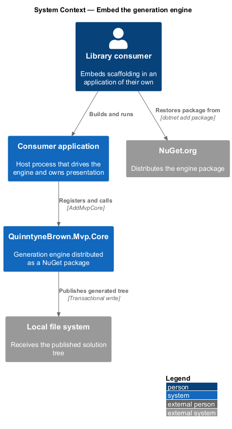
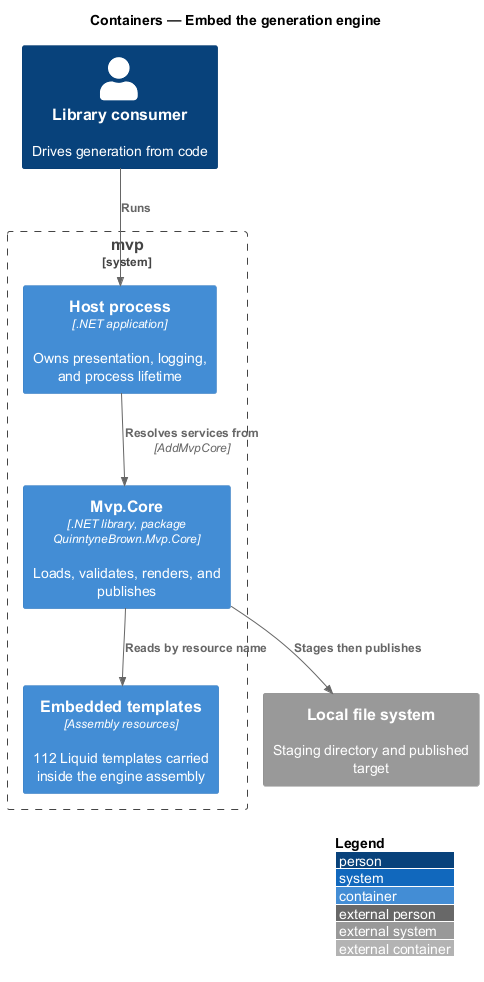
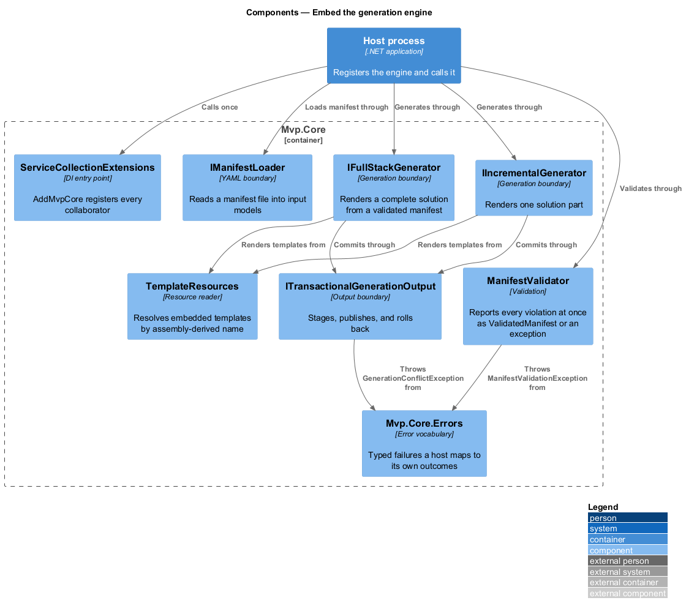
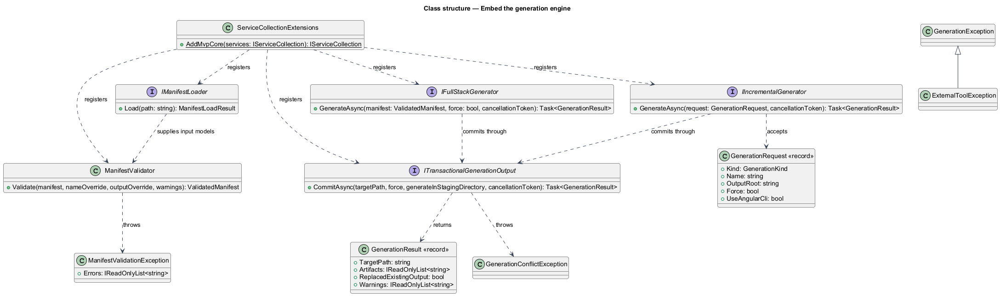
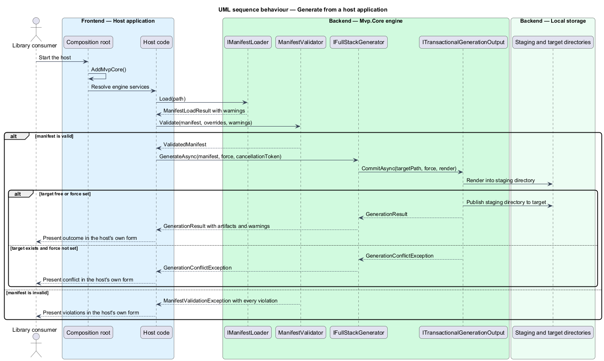

# Embed the generation engine

## Overview

The generation engine is the part of `mvp` that turns a solution description
into a source tree. It ships as the NuGet package `QuinntyneBrown.Mvp.Core`,
independently of the `mvp` command-line tool, so a team can generate solutions
from inside an application it owns.

*Host* — program that drives the engine and owns presentation, logging, and
process lifetime. The command-line tool is one host; a service, an internal
portal, or a test fixture is another.

This feature covers package distribution, the registration entry point, the
supported public surface, the typed error vocabulary, the templates carried
inside the assembly, and the division of responsibility between engine and
host. It begins when a project references the package and ends when the engine
returns a `GenerationResult` or throws a typed failure.

## Description

- **`Mvp.Core.csproj`** — package definition for `QuinntyneBrown.Mvp.Core`. It
  opts into packing, enables package validation, ships its own readme, and
  embeds `Templates\**\*` as assembly resources. `AssemblyName` and
  `RootNamespace` are pinned equal because embedded resource names derive from
  the root namespace while lookup derives from the assembly name.
- **`ServiceCollectionExtensions.AddMvpCore`** (`Mvp.Core`) — the single
  registration entry point. It registers `ManifestValidator`, `IManifestLoader`,
  `ITransactionalGenerationOutput`, `IProcessRunner`, `IIncrementalGenerator`,
  and `IFullStackGenerator` as singletons, rejects a null collection, and
  returns the same collection so registration can be chained.
- **`IManifestLoader` and `ManifestLoadResult`** (`Mvp.Core`) — the input
  boundary. Loading yields the mutable input models plus the warnings raised by
  unmatched YAML fields; `ManifestLoadResult.CreateEmpty()` serves hosts that
  generate without a manifest file.
- **`ManifestValidator`** (`Mvp.Core`) — converts input models into the
  immutable `Validated*` family. It collects every violation before throwing, so
  one call reports the complete problem set rather than the first failure.
- **`IFullStackGenerator` and `IIncrementalGenerator`** (`Mvp.Core`) — the two
  generation boundaries. Each accepts a cancellation token and returns a
  `GenerationResult` carrying the committed target path, the artifact list,
  whether existing output was replaced, and any warnings.
- **`TemplateResources`** (`Mvp.Core`) — resolves the 112 embedded templates, 92
  for full-stack generation and 20 for incremental generation, by a prefix
  derived from the assembly. No template is read from disk, so generation needs
  no network access and no template files beside the package.
- **`Mvp.Core.Errors`** — the failure vocabulary. `ManifestValidationException`
  carries every violation in `Errors`; `GenerationConflictException` reports an
  existing target; `ExternalToolException` derives from `GenerationException`,
  so a host can catch the specific or the general case.
- **Host boundary** — the engine writes to no console stream, terminates no
  process, reads no command-line argument, and takes no dependency on a hosting
  or logging framework. Outcomes leave the engine as return values and typed
  exceptions, which is what lets `Mvp.Cli` map them to exit codes while another
  host maps them to its own reporting.
- **Version and release contract** — one `<Version>` in
  `Directory.Build.props` governs every package the repository produces.
  Releases originate from a version tag, and the release workflow refuses to
  publish when the tag and the declared version disagree.

## Requirements

The table reproduces the normative requirement text from `docs/specs/L2.md`.

| L2 ID | Refines (L1) | Requirement |
|-------|--------------|-------------|
| `L2-071` | `L1-018` | The generation engine must be published as a NuGet package that any .NET project can reference, and that package must describe itself well enough to be adopted without reading the product's source. |
| `L2-072` | `L1-018` | The engine must be registered through a single documented call, so that a library consumer never has to know which concrete types implement which part of generation. |
| `L2-073` | `L1-018` | The engine must publish a named, supported surface that library consumers can build against, and must not break that surface outside a major version. |
| `L2-074` | `L1-018` | The engine must report failure through distinguishable exception types carrying structured detail, so that a host can decide how to present each outcome without parsing message text. |
| `L2-075` | `L1-018` | Everything the engine renders must travel with the engine, so that generation works offline and cannot be broken by a missing or mismatched template file on disk. |
| `L2-076` | `L1-018` | The engine must leave presentation and process lifetime to its host, so that it behaves identically inside a command-line tool, a service, or a test. |
| `L2-077` | `L1-018` | The engine's release process must be predictable and documented, so that a library consumer can judge the risk of taking an upgrade. |

`L2-073` carries `Partial` status. Package validation runs, but no baselined
comparison against a previously published version is enforced, so removal of a
public member is not yet caught automatically.

## Diagrams

### System context

A library consumer restores the engine package from NuGet.org and runs a host
application of their own; the engine publishes the generated tree to local
storage.

### Containers

The host process and the engine library are separate containers. Templates
travel inside the engine assembly rather than beside it.

### Components

`AddMvpCore` registers the loading, validation, generation, and output
components the host then resolves and calls.

### Class structure

The supported surface is the registration entry point, the manifest boundary,
the two generation boundaries with their request and result records, and the
error hierarchy under `L2-073`.

### Behaviour — generate from a host application

The host loads, validates, and generates in three calls. Invalid input under
`L2-074` and an occupied target under `L2-068` reach the host as typed
exceptions, and presentation of each outcome stays with the host under `L2-076`.

