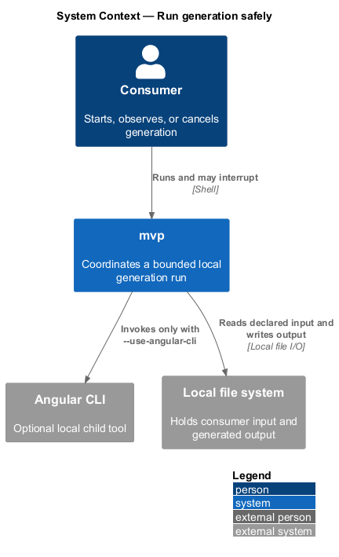
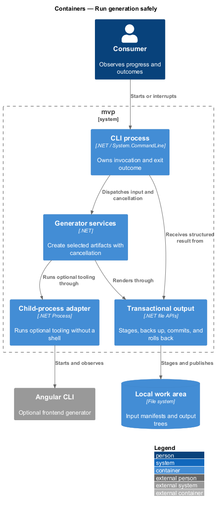
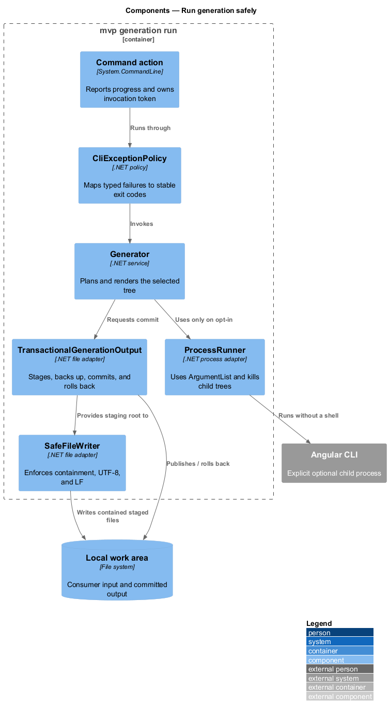
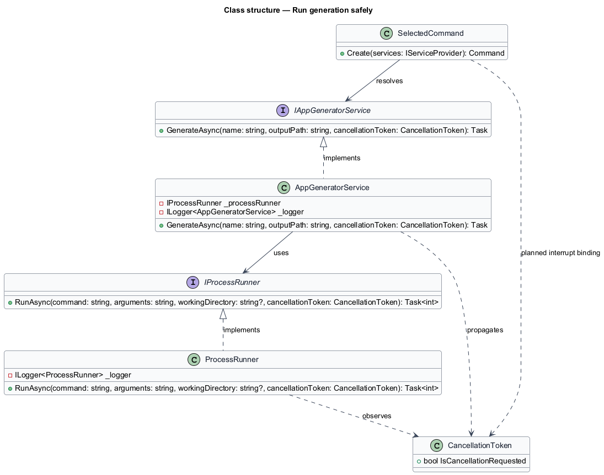
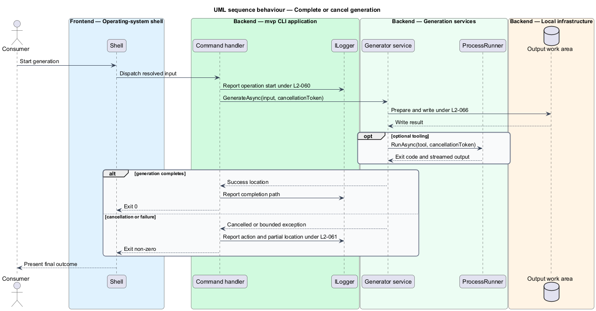

# Run generation safely

## Overview

A generation run converts local input into a local source tree. *Run safety*
covers progress visibility, actionable failures, cancellation, environment
differences, output preparation, privacy, reproducibility, and protection of
existing work.

This feature surrounds every generator. It begins when a command accepts its
resolved inputs and ends with a confirmed output path, a bounded failure, or a
reported cancellation state.

## Description

Run safety is divided between the two assemblies. `Mvp.Core` owns the
guarantees — containment, staging, rollback, cancellation, and locality — so
they hold for every host. `Mvp.Cli` owns presentation of the outcome.

- **`CliExceptionPolicy`** (`Mvp.Cli`) — maps typed failures to stable exit codes
  and emits concise stderr by default. `--diagnostic` opts into internal detail.
- **Command actions** (`Mvp.Cli`) — report generation start, pass the invocation
  cancellation token, and print the final artifact count and committed target.
- **`ProcessRunner`** (`Mvp.Core`) — starts optional external tooling without a
  shell, captures standard output and error, forwards the cancellation token to
  `WaitForExitAsync`, kills the complete child tree on cancellation, and returns
  the captured streams and the child exit code in a `ProcessResult` for the host
  to present.
- **`IncrementalGenerator`** (`Mvp.Core`) — uses packaged Angular templates by
  default and calls Angular CLI only under explicit `--use-angular-cli`.
- **Path construction** — uses `Path.Combine` and
  `Directory.GetCurrentDirectory()` for platform-native paths and defaults.
- **`TransactionalGenerationOutput`** (`Mvp.Core`) — creates missing parents only after
  validation, renders into a unique sibling stage, and publishes with one move.
  Existing targets conflict unless `--force`; forced runs use a sibling backup
  and rollback if publication fails.
- **Local generation boundary** — manifest reading and artifact writing stay on
  the local machine. `Mvp.Core` defines no telemetry or content-upload client
  and takes no dependency on an HTTP client.
- **`SafeFileWriter`** (`Mvp.Core`) — proves every rendered relative path remains contained
  by the staging root and applies UTF-8 without BOM plus LF line endings.
- **Cancellation boundary** — the invocation token flows through rendering,
  async writes, output publication, and child-process termination.
- **Reproducibility controls** — templates and resolved input determine output.
  The generated tree contains no generation timestamp, machine name, or user
  name.

## Requirements

The table reproduces the normative requirement text from `docs/specs/L2.md`.

| L2 ID | Refines (L1) | Requirement |
|-------|--------------|-------------|
| `L2-053` | `L1-011` | The tool must not send the consumer's manifest, source, or generated output anywhere. |
| `L2-060` | `L1-014` | The tool must report what it is doing while it runs, so that a consumer can distinguish work from a hang. |
| `L2-061` | `L1-014` | Every failure must tell the consumer what went wrong and what to do next. |
| `L2-062` | `L1-014` | A consumer must be able to stop a running generation without leaving the machine in an unclear state. |
| `L2-063` | `L1-015` | The tool must generate Angular applications from packaged templates by default and invoke Angular command-line tooling only when the consumer explicitly requests it. |
| `L2-064` | `L1-015` | The tool must behave identically on every supported operating system. |
| `L2-065` | `L1-015` | The consumer must be told which additional tooling is needed to run — as opposed to generate — the solution. |
| `L2-066` | `L1-016` | The tool must prepare the location it writes to without requiring the consumer to create directories in advance. |
| `L2-067` | `L1-016` | The same input must produce the same output, so that generation results can be reviewed and compared. |
| `L2-068` | `L1-016` | The tool must never silently overwrite consumer work. |

## Diagrams

### System context

The consumer runs `mvp` against local input and local storage; optional Angular
CLI executes as a child process without receiving content over a network.

### Containers

The CLI coordinates generator services, child tooling, logging, and the local
file system around one generation run.

### Components

The command handler owns the outcome boundary, while `ProcessRunner`, the
transactional output, and renderers expose progress and cancellation points.

### Class structure

Generator interfaces carry cancellation through concrete services, which depend
on logging, process, and file-system boundaries.

### Behaviour — complete or cancel generation

The run reports stages, propagates cancellation under `L2-062`, and returns a
bounded outcome without transmitting consumer content under `L2-053`.

