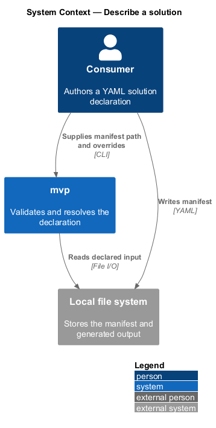
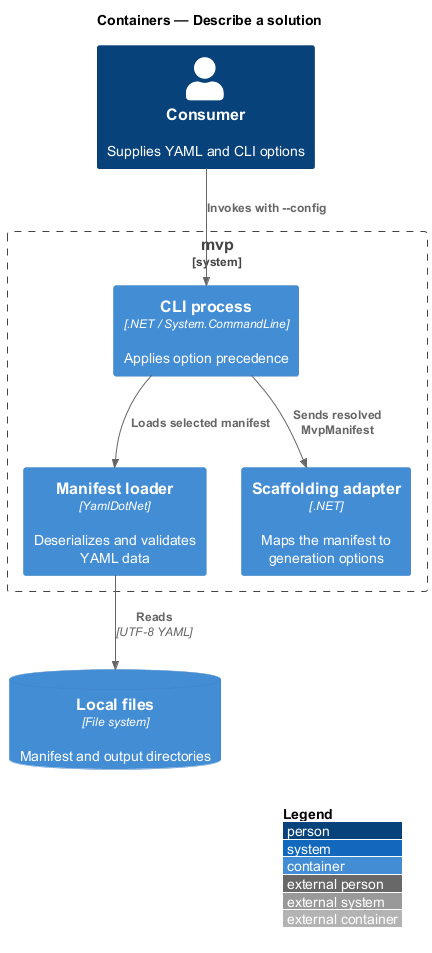
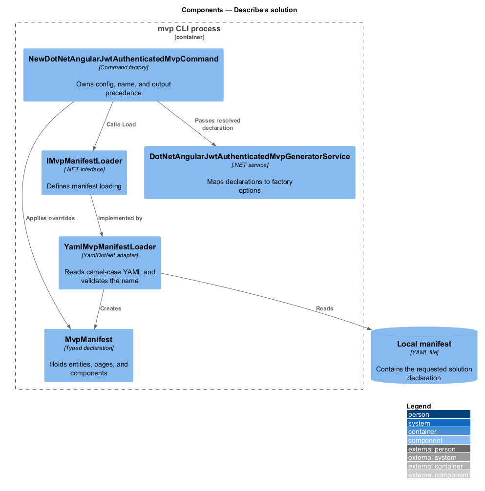
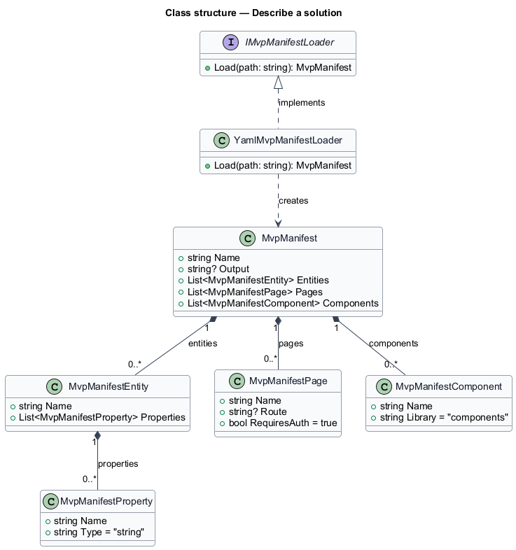
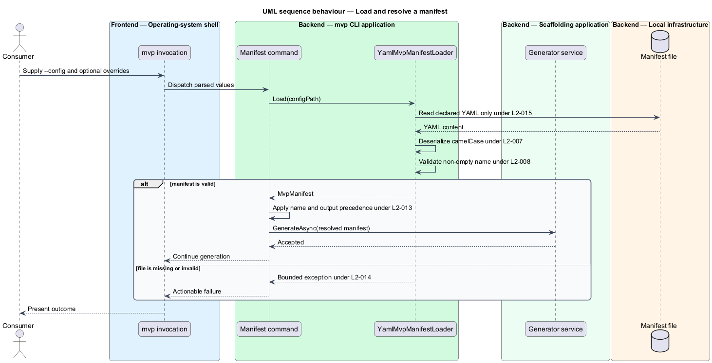

# Describe a solution

## Overview

A *manifest* is a YAML document that describes the solution a consumer wants
`mvp` to generate. It names the solution and may declare an output location,
domain entities, application pages, and reusable frontend components. The file
is plain data suitable for version control.

This feature turns manifest content and command-line overrides into one typed
`MvpManifest`. The resulting object is the input to full-stack generation.
Validation occurs before the generator writes the solution tree.

## Description

- **`NewDotNetAngularJwtAuthenticatedMvpCommand`** — owns `--config`,
  `--name`, and `--output`. A command-line name overrides the manifest name; a
  command-line output overrides the manifest output.
- **`IMvpManifestLoader`** — boundary for loading a manifest from a path.
- **`YamlMvpManifestLoader`** — YamlDotNet adapter. It applies camel-case field
  naming, ignores unmatched fields for forward compatibility, rejects missing
  files, and rejects empty or unnamed manifests.
- **`MvpManifest`** — solution declaration with `Name`, `Output`, `Entities`,
  `Pages`, and `Components`.
- **`MvpManifestEntity` and `MvpManifestProperty`** — entity declarations. A
  property defaults its type to `string`.
- **`MvpManifestPage`** — page declaration. `RequiresAuth` defaults to `true`;
  an omitted route reaches the downstream factory as an empty value.
- **`MvpManifestComponent`** — component declaration. `Library` defaults to
  `components`.
- **`DotNetAngularJwtAuthenticatedMvpGeneratorService`** — mapping boundary. It
  converts manifest declarations into `JwtAuthenticatedMvpOptions` and its
  entity, page, property, and component option types.

The loader uses a data deserializer and performs no command execution or
runtime-type lookup from manifest values. Validation rules beyond the current
name and YAML checks remain owned by `<TO SUPPLY>`.

## Requirements

The table reproduces the normative requirement text from `docs/specs/L2.md`.

| L2 ID | Refines (L1) | Requirement |
|-------|--------------|-------------|
| `L2-007` | `L1-003` | The solution declaration must be a YAML document using camelCase field names, readable and editable without tooling and safe to store in version control. |
| `L2-008` | `L1-003` | A solution name must be supplied before generation proceeds, because it determines the solution directory, the namespace root, and the frontend workspace prefix. |
| `L2-009` | `L1-003` | The manifest must allow zero or more domain entities, each with zero or more typed properties, and must generate persistence, application, and interface artifacts from each. |
| `L2-010` | `L1-003` | The manifest must allow zero or more application pages, each with an optional route and an access requirement that defaults to authenticated. |
| `L2-011` | `L1-003` | The manifest must allow zero or more reusable components, each assigned to a named frontend library. |
| `L2-012` | `L1-003` | A manifest authored against one release must remain loadable by later releases, and unknown fields must not halt generation. |
| `L2-013` | `L1-003` | Where the same value can be supplied by more than one channel, precedence must be defined and documented. |
| `L2-014` | `L1-003` | A manifest path that cannot be read must produce a clear, actionable failure rather than an unhandled error. |
| `L2-015` | `L1-003` | The manifest must be treated strictly as data. No content within a manifest may cause the tool to execute arbitrary code, resolve arbitrary types, or read files outside the declared inputs. |

## Diagrams

### System context

The consumer supplies YAML to `mvp`; the tool treats that content as data and
passes a typed declaration to solution generation.

### Containers

The CLI loads the manifest from the local file system and sends validated,
resolved options to the scaffolding library.

### Components

The command applies precedence around `YamlMvpManifestLoader`, then the
generator service maps the result into package-owned option types.

### Class structure

`MvpManifest` owns collections of entity, page, and component declarations;
each entity owns its property declarations.

### Behaviour — load and resolve a manifest

The command loads YAML, validates the solution name, applies option precedence,
and maps the resolved declaration under `L2-007` through `L2-015`.

