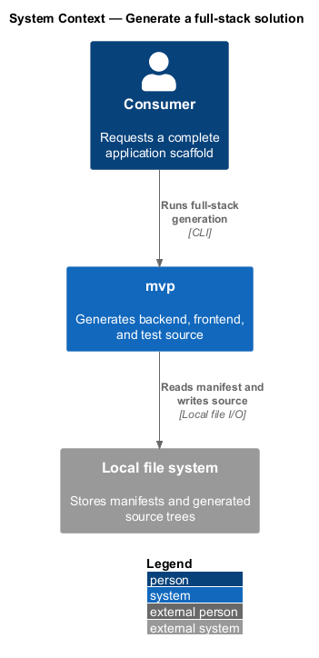
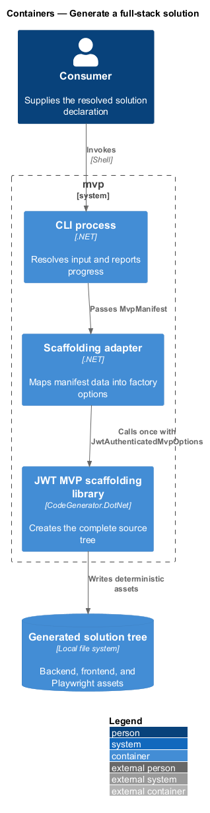
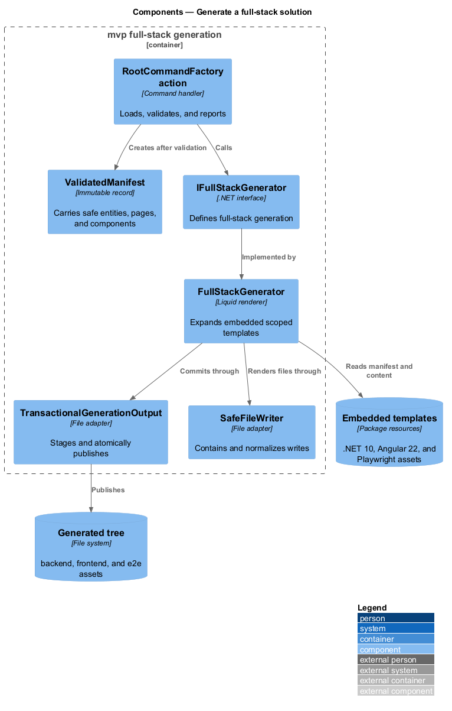
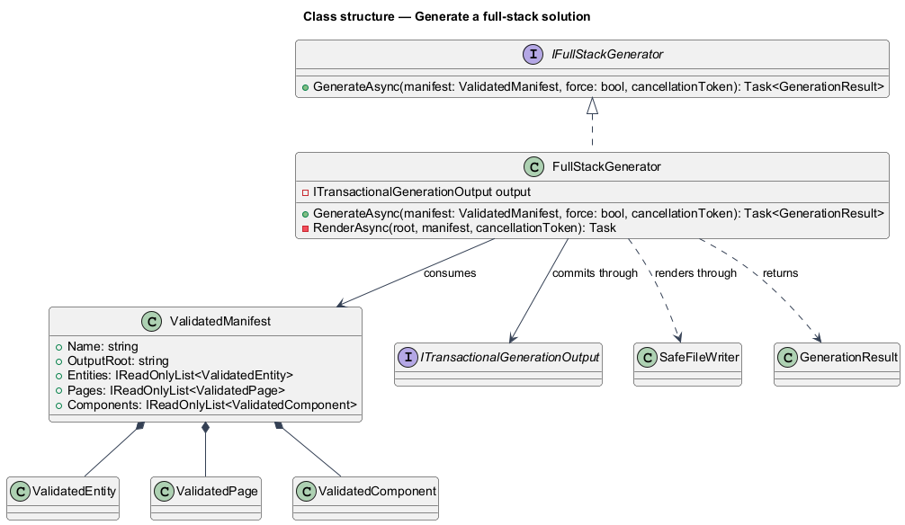
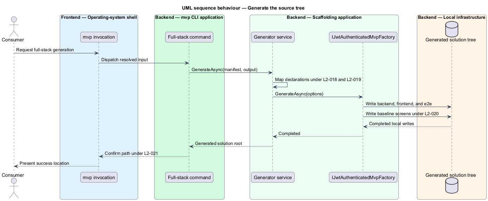

# Generate a full-stack solution

## Overview

A *full-stack solution* is the generated source tree containing a layered .NET
backend, an Angular workspace, and a Playwright end-to-end test suite. This
feature creates that tree from one `ValidatedManifest`, including baseline
authentication screens when the manifest declares no domain content.

The generated directory sits below the selected output location and uses the
manifest name. Generation builds files from local templates and defers package
restoration to the consumer.

## Description

Full-stack generation lives entirely in `Mvp.Core`. `Mvp.Cli` contributes the
command entry and nothing else, so a library consumer calling
`IFullStackGenerator` directly produces the same tree.

- **`RootCommandFactory`** (`Mvp.Cli`) — full-stack command entry. It resolves
  overrides, loads and validates the manifest, and invokes the generator inside
  the common exception policy.
- **`IFullStackGenerator` and `FullStackGenerator`** (`Mvp.Core`) — engine
  boundary and renderer for manifest-based generation.
- **Embedded Liquid templates** (`Mvp.Core`) — MIT-attributed, product-owned
  backend, frontend, component, page, entity, and end-to-end assets. Template
  paths are declared in an embedded manifest and checked for containment before
  each write.
- **`ValidatedManifest`** (`Mvp.Core`) — immutable generation model containing
  the solution name, normalized output, entities, pages, components, and warnings.
- **`TransactionalGenerationOutput`** (`Mvp.Core`) — renders the complete source
  tree in a sibling stage and commits it atomically.
- **Generated solution tree** — `backend/`, `frontend/`, and `frontend/e2e/`
  roots. The checked-in `out/Acme` sample demonstrates the current output.
- **Baseline output** — sign-in, sign-up, and dashboard screens plus the
  authentication API and test harness, independent of manifest collections.
- **Structured result** — returns the committed root, sorted artifact list,
  replacement flag, and cleanup warnings for command reporting and tests.

The generator does not start a restore command. `PerformanceGenerationTests`
release-gates the name-only 10-second threshold, representative 30-second
threshold, and 512 MiB process budget without restoring generated dependencies.

## Requirements

The table reproduces the normative requirement text from `docs/specs/L2.md`.

| L2 ID | Refines (L1) | Requirement |
|-------|--------------|-------------|
| `L2-016` | `L1-004` | One command must produce the complete solution, laid out in a documented and predictable directory structure. |
| `L2-017` | `L1-004` | The product must produce a useful baseline even when the consumer declares no entities, pages, or components. |
| `L2-018` | `L1-004` | Each declared entity must produce a complete vertical slice across the backend layers so that the consumer can create and retrieve instances of it without writing code. |
| `L2-019` | `L1-004` | Each declared page must produce a screen, a route registration, and a corresponding end-to-end test scaffold. |
| `L2-020` | `L1-004` | Sign-in, sign-up, and dashboard screens must be present in every generated solution regardless of the manifest contents. |
| `L2-021` | `L1-004` | On success, the product must confirm what it produced and where, so the consumer never has to search for the output. |
| `L2-057` | `L1-013` | Generation must be fast enough to be part of an interactive workflow. |
| `L2-058` | `L1-013` | Generating a solution must not require network access. |

## Diagrams

### System context

The consumer asks `mvp` for a solution; the tool creates a local source tree
without contacting an external service.

### Containers

The CLI passes validated data to a local renderer, which writes backend,
frontend, and test assets through the transactional output boundary.

### Components

The command delegates to `FullStackGenerator`, which reads embedded template
metadata and renders root-, entity-, page-, and component-scoped entries.

### Class structure

The generator transforms validated collections into invariant Liquid tokens
before rendering scoped template entries through the safe writer.

### Behaviour — generate the source tree

The factory receives resolved options, writes each solution area, and returns
control so the CLI can confirm the location under `L2-021`.

