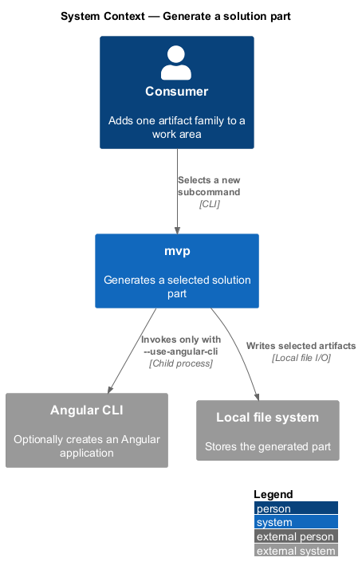
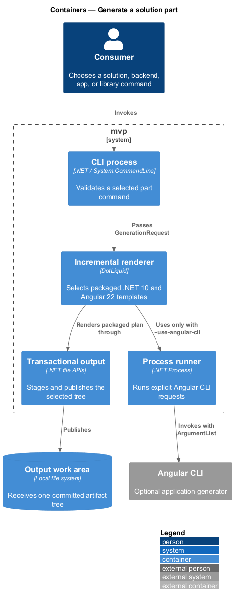
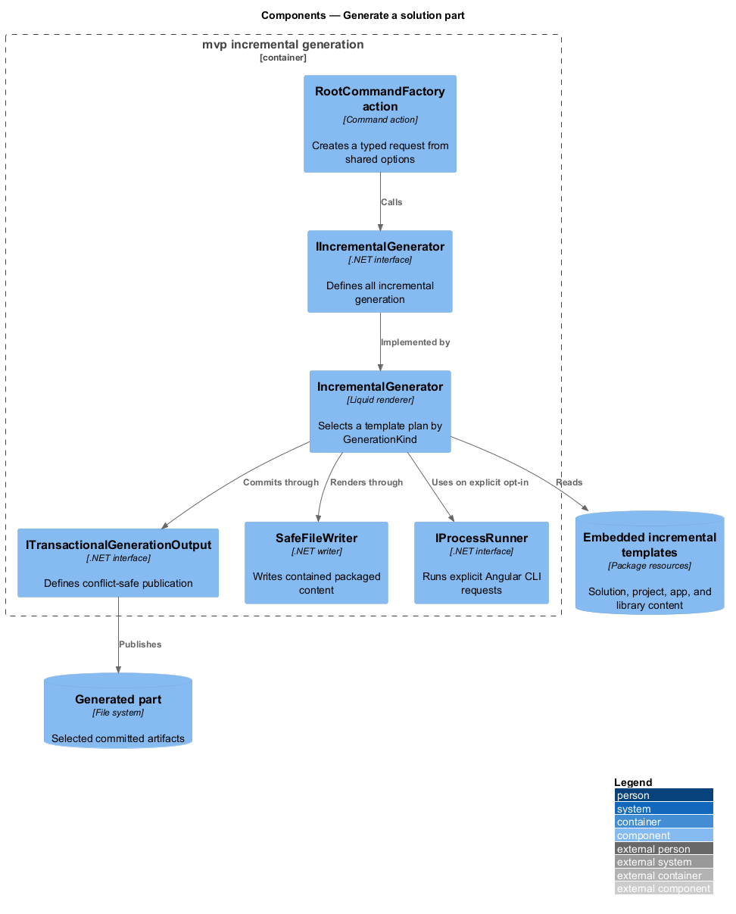
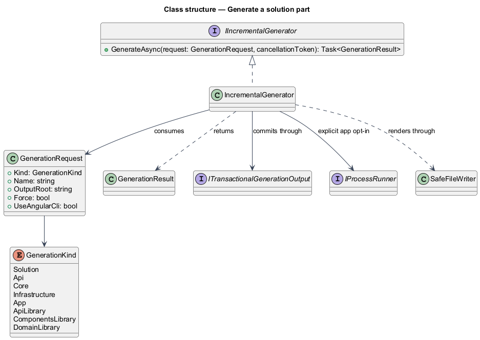
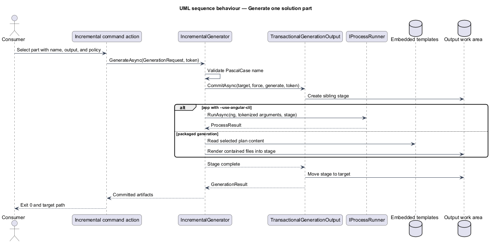

# Generate a solution part

## Overview

Incremental generation creates one structural part without rebuilding an entire
application. A *solution part* is a solution shell, backend project, Angular
application, or Angular library selected below the `mvp new` command group.

Each command shares one typed input surface and delegates file creation to the
incremental generator, which selects a packaged template plan by artifact kind.

## Description

The eight command names belong to `Mvp.Cli`; the request type, the plan, and
the rendering belong to `Mvp.Core`. A library consumer selects the same eight
parts by constructing a `GenerationRequest` instead of typing a command name.

- **`RootCommandFactory`** (`Mvp.Cli`) — registers all eight incremental command
  names and shared `--name`, `--output`, and `--force` options.
- **`GenerationKind`, `GenerationRequest`, and `GenerationResult`** (`Mvp.Core`)
  — strong types that describe the selected artifact, normalized input, and
  committed output without command-specific service duplication.
- **`IIncrementalGenerator` and `IncrementalGenerator`** (`Mvp.Core`) — choose the embedded
  template plan and render .NET 10 or Angular 22 files through `SafeFileWriter`.
- **Packaged templates** (`Mvp.Core`) — solution, API, Core, Infrastructure, app,
  and three library variants live as independently syntax-checkable resources.
- **`IProcessRunner`** (`Mvp.Core`) — used only when app generation explicitly
  receives `--use-angular-cli`; tokenized arguments and cancellation apply.
- **`TransactionalGenerationOutput`** (`Mvp.Core`) — gives every incremental command the
  same conflict, `--force`, stage, commit, and rollback semantics.

Packaged generation is the offline default and never probes the machine for an
Angular CLI. This keeps identical input deterministic across environments.

## Requirements

The table reproduces the normative requirement text from `docs/specs/L2.md`.

| L2 ID | Refines (L1) | Requirement |
|-------|--------------|-------------|
| `L2-022` | `L1-005` | The product must generate a solution shell — a solution file with its initial backend project and frontend application — independently of full-stack generation. |
| `L2-023` | `L1-005` | The product must generate each backend layer project independently, so a consumer can add a missing layer to existing work. |
| `L2-024` | `L1-005` | The product must generate a standalone frontend application project independently of full-stack generation. |
| `L2-025` | `L1-005` | The product must generate each of the three frontend library types independently. |
| `L2-026` | `L1-005` | Generated frontend services must be consumed through an interface and an injection token rather than a concrete type, so that consumers can substitute implementations in tests and in alternative deployments. |

## Diagrams

### System context

The consumer selects one artifact family through `mvp`; optional Angular CLI
participates only in frontend application generation.

### Containers

The CLI dispatches every part to the local incremental renderer, with Angular
CLI as an explicit application-only branch.

### Components

Each command resolves one generator interface, while shared package factories
or `IProcessRunner` perform the low-level work.

### Class structure

Command factories depend on generator interfaces; concrete services depend on
the package factory, artifact writer, or process runner appropriate to the part.

### Behaviour — generate one part

The selected command validates `--name` and `--output`, resolves its service,
and reports the generated artifact under `L2-022` through `L2-026`.

